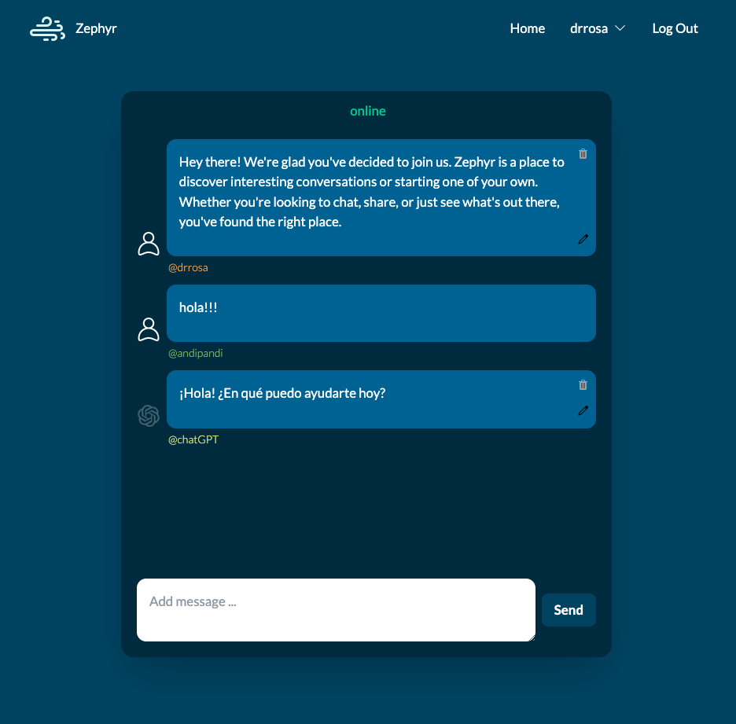
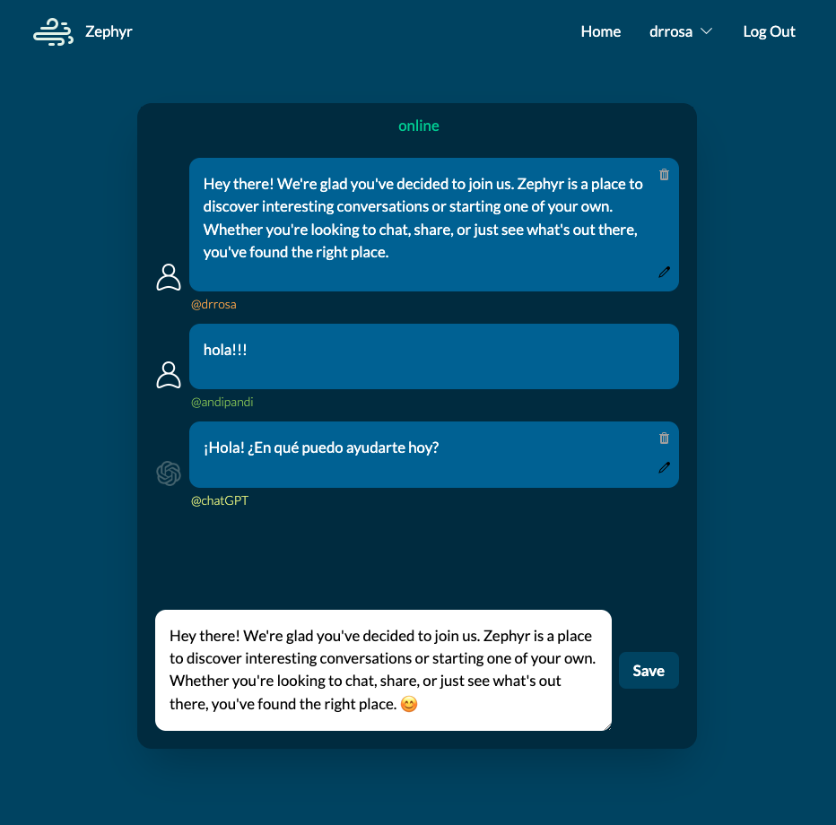

# Zephyr

Zephyr is simple instant chat application built with Django that allows multiple users to engage in conversations and interact with a large language model (LLM). This platform aims to combine real-time chatting capabilities with the intelligence of GPT-based models, hoping to provide users with unique and engaging conversational experiences.

# Screenshots

# Technologies Used

- **Python** for backend logic.
- **Django** as the web framework.
- **HTMX** for dynamic page updates without full reloads.
- **OpenAI's API** for communication with the GPT model.
- **PostgreSQL** for data storage in development.
- **HTML, CSS (Tailwind CSS)**, and **JavaScript** for front-end development.

# Getting Started

To get started with Zephyr:

- [Click to start chatting](https://zephyr-chat-8ea5a3a3687c.herokuapp.com/)
- [Click to View Project Planning](https://trello.com/b/Veuc6j3Y/sei-project-3)

# Next Steps

- **Enhanced User Profiles**: To allow users to customize their profile and keep track of their chatting history.
- **Real-time Notifications**: Implement real-time notifications for incoming messages or system updates.
- **Expanded Language Support**: Integrate additional language models to leverage different capabilities.
- **Scalability Improvements**: Optimize backend architecture to support a larger number of simultaneous users.

Zephyr is an experiment in blending messaging platforms with advanced AI capabilities, offering a novel approach to online communication. Its development journey continues as we explore new features and improvements to enhance user experience and engagement.
